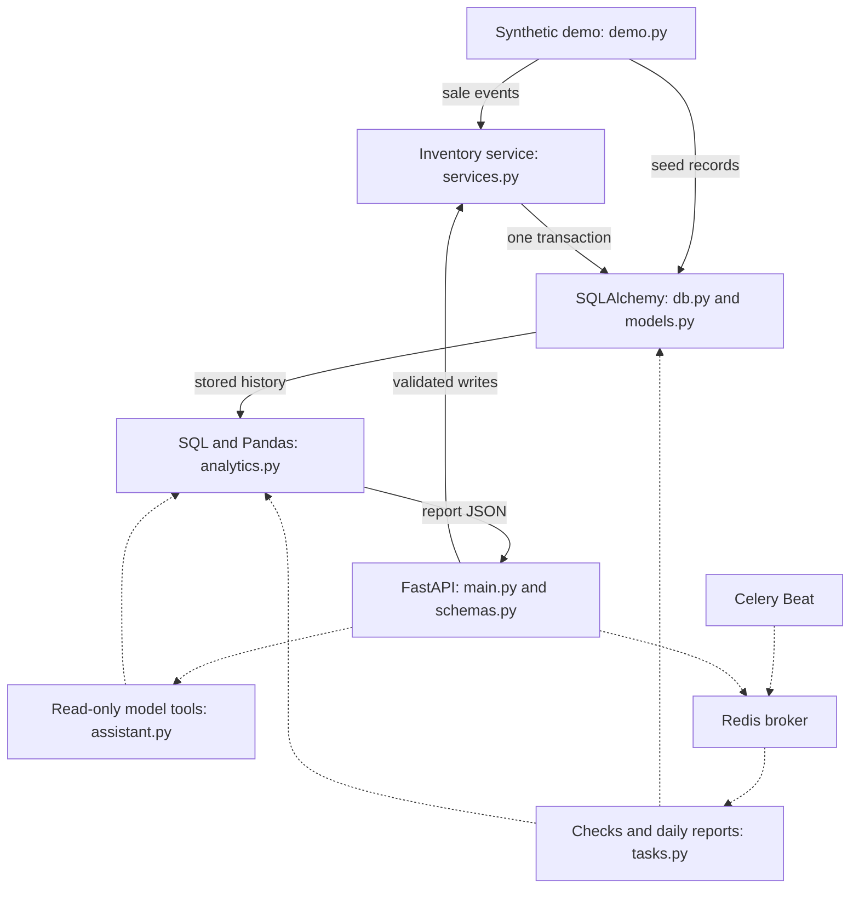

# RestaurantOps AI

Restaurant inventory and analytics backend built with Python, FastAPI, and SQLAlchemy. The platform converts normalized sales events into ingredient usage, stock movements, cost reports, demand forecasts, and reorder recommendations.

**Development stage:** Core inventory and analytics workflows implemented. POS integration and restaurant pilot validation are the next milestones. The included demonstration uses synthetic operating data.

## Capabilities

| Area | Implementation |
| --- | --- |
| Inventory | Quantities, units, par levels, targets, receipts, and physical counts |
| Recipes and suppliers | Recipe-to-ingredient quantities and vendor relationships |
| Sales | Ingredient aggregation, atomic depletion, and idempotent sale IDs |
| Cost analytics | Revenue, COGS, and gross profit with historical snapshots |
| Demand planning | Trailing-average forecasts, chronological evaluation, and reorder quantities |
| Exception checks | Usage spikes, count variance, and low-stock reports |
| Background tasks | Hourly inventory checks and daily reports with Celery/Redis configuration |
| Natural-language reports | Restricted LLM adapter over three deterministic, read-only tools |

**Stack:** Python, FastAPI, SQLAlchemy, PostgreSQL, Pandas, NumPy, Celery, Redis, and Docker. SQLite supports the standalone development demo.

## Architecture diagram

Solid arrows trace the core data flow. Dashed arrows show optional worker and model integrations. Their transport/provider verification is listed below.



Python modules are under `app/`. `compose.yaml` defines PostgreSQL, Redis, the API, one worker, and one Beat scheduler. The LLM tool allowlist exposes no inventory writes or arbitrary SQL.

## Run locally

Requires Python 3.11+; local verification used Python 3.12.

```bash
python -m venv .venv
source .venv/bin/activate
python -m pip install -e ".[dev]"
python -m app.demo
uvicorn app.main:app --host 127.0.0.1 --port 8000
```

The [API explorer](http://127.0.0.1:8000/docs) exposes inventory, recipe, sales, and reporting endpoints. The seed creates one synthetic supplier, two ingredients, one flatbread recipe, and 28 simulated sales days. It requires an empty inventory. Set `DATABASE_URL=sqlite:///./demo.db` for a separate demonstration database.

### Example sale

After seeding, two flatbreads consume 0.50 kg flour and 0.20 kg cheese. At demo prices, ingredient COGS is $2.60 and revenue is $24.00. Use a current or past UTC timestamp.

```bash
curl -X POST http://127.0.0.1:8000/sales \
  -H 'Content-Type: application/json' \
  -d '{"external_id":"example-sale-1","occurred_at":"2026-10-01T16:00:00Z","lines":[{"recipe_id":1,"quantity":2}]}'
curl http://127.0.0.1:8000/reports/costs
curl http://127.0.0.1:8000/reports/forecast
```

An identical external sale ID and payload returns `duplicate:true` without consuming stock again. Reusing the ID with a different payload returns HTTP 409.

## Implementation details

- **Transactional inventory:** Aggregate requirements across recipes, then use conditional stock updates within one transaction. A shortage rolls back the entire sale.
- **Historical accounting:** Consumption records retain unit-cost snapshots; sale lines retain price snapshots. Revenue and COGS are aggregated separately to avoid multiplying joined rows.
- **Precision and units:** Decimal quantities use three places, unit costs four, and prices two. Recipe quantities use the ingredient's stated unit.
- **Chronological forecasting:** Average the previous 14 complete UTC days and evaluate over seven walk-forward days using MAE and a previous-day baseline. Missing days count as zero, assuming ingestion is complete.
- **Bounded model access:** Validate tool names and arguments, limit the tool loop, and return deterministic report data alongside generated text.

| Module | Responsibility |
| --- | --- |
| `models.py`, `db.py` | Schema, constraints, sessions, and initialization |
| `schemas.py`, `main.py` | Validation, routes, and optional token protection |
| `services.py` | Sales, receipts, counts, and movements |
| `analytics.py` | Costs, forecasts, evaluation, reorders, and inspection rules |
| `tasks.py`, `assistant.py` | Background reports and controlled natural-language access |
| `sql/reports.sql` | PostgreSQL report queries |
| `tests/` | Isolated behavior and regression checks |

## PostgreSQL and background services

```bash
export POSTGRES_PASSWORD="$(python -c 'import secrets; print(secrets.token_hex(16))')"
export API_TOKEN="$(python -c 'import secrets; print(secrets.token_hex(16))')"
docker compose up --build
```

Compose binds the API to localhost and requires `X-API-Key`. PostgreSQL and Redis ports are not exposed. Inventory checks run hourly; the daily report runs at 00:05 UTC and is available through `/reports/daily`.

Set `OPENAI_API_KEY` and `OPENAI_MODEL` to enable `/assistant`. Without model configuration it returns HTTP 503. `.env.example` lists configuration options; credentials stay outside Git.

## Verification and development status

**22 tests passed**, with Ruff lint and format checks passing. Tests cover transaction rollback, shared ingredients, repeated/conflicting events, historical costs, validation, forecasts, chronological evaluation, task idempotency, and the model-tool allowlist.

```bash
pytest -q
ruff check app tests
ruff format --check app tests
```

Behavior tests use SQLite. Celery task bodies are tested directly/eagerly, and model responses are mocked. PostgreSQL DDL compilation and Compose YAML parsing passed; live PostgreSQL, Redis delivery, Docker startup, and provider calls remain integration checks. [Verification record](docs/verification.json).

Next deployment milestones include POS ID mapping and reconciliation, migrations, per-user authorization, and restaurant-specific units and operating hours. Forecasts are baseline estimates; anomaly checks support inspection. Refunds, prep yields, waste, purchase-cost accounting, and lead times require additional domain rules. Receipts and counts are not idempotent event APIs.
