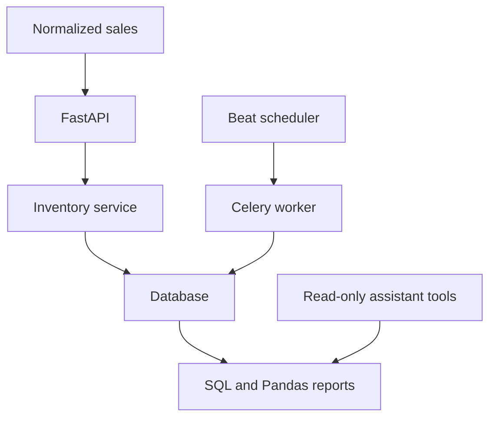

# RestaurantOps AI

A small Python backend that turns recipe sales into ingredient usage, inventory changes, and cost reports.

Restaurants often track sales, recipes, purchasing, and stock in separate places. This project connects those records so a sale has a clear effect on ingredients and costs. The design is informed by restaurant work and focuses on operations that can be checked with Python and SQL.

**Current source:** a newly written student implementation prepared in October 2026 with coding assistance. It uses synthetic restaurant scenarios. No earlier project source was available for comparison. This repository does not establish that this exact implementation existed before October, that a live POS integration works, or that a restaurant pilot has run.

## What works

| Capability | Implementation | Evidence |
| --- | --- | --- |
| Recipes and suppliers | Normalized ingredient, recipe, and vendor tables | API and database tests |
| Inventory depletion | Aggregate recipe quantities, then update stock in one transaction | Rollback and retry tests |
| COGS and revenue | SQL aggregates using saved cost and price snapshots | Historical-cost test |
| Low stock and reorders | Compare stock to par; recommend a quantity to reach target | Scenario test |
| Demand forecasting | Trailing calendar-day average and chronological MAE evaluation | Known-value tests |
| Anomaly checks | Daily usage spike rule and physical-count variance | Scenario tests |
| Asynchronous checks and analytics | Hourly inventory task, daily report task, Redis broker and Beat schedules | Task bodies tested locally; live stack pending |
| Natural-language interface | OpenAI Responses adapter with three read-only report tools | Mocked tool-loop test; live provider pending |

Forecasts are simple baselines. There is no trained neural model or measured improvement on real restaurant data.

## Start locally

Python 3.11+ is required; verification used Python 3.12. SQLite is the default so the core demo needs no server or model key.

```bash
python -m venv .venv
source .venv/bin/activate
python -m pip install -e ".[dev]"
python -m app.demo
uvicorn app.main:app --host 127.0.0.1 --port 8000
```

Open [the API explorer](http://127.0.0.1:8000/docs). `app.demo` refuses to seed an inventory that already contains items. For a fresh isolated demo, set `DATABASE_URL=sqlite:///./demo.db` before seeding and starting the API. Never point a synthetic seed at a business database.

The seed contains one synthetic supplier, two ingredients, one flatbread recipe, and 28 simulated sales days. It prints cost, forecast, and evaluation reports. The scenarios are generated in `app/demo.py`; they are not imported restaurant records.

### Example sale

After seeding, recipe 1 consumes 0.25 kg flour and 0.10 kg cheese per portion. Replace the sample timestamp with a current or past UTC timestamp.

```bash
curl -X POST http://127.0.0.1:8000/sales \
  -H 'Content-Type: application/json' \
  -d '{"external_id":"manual-example-1","occurred_at":"2026-10-01T16:00:00Z","lines":[{"recipe_id":1,"quantity":2}]}'

curl http://127.0.0.1:8000/reports/costs
curl http://127.0.0.1:8000/reports/forecast
curl http://127.0.0.1:8000/reports/forecast/evaluation
```

The first request returns `{"sale_id":29,"duplicate":false}` in a freshly seeded database. Repeating the identical event returns `duplicate:true` and does not deplete stock again. Reusing the ID with different content returns HTTP 409. Two flatbreads use 0.50 kg flour and 0.20 kg cheese; with the demo prices their COGS is $2.60 and revenue is $24.00.

## How it fits together

FastAPI validates normalized sale events. `services.record_sale` calculates ingredient usage and writes the sale, inventory changes, and movement records in one database transaction. SQL provides cost totals; Pandas builds daily usage series; NumPy computes simple baseline errors and usage thresholds. The model can ask for those reports but cannot change inventory or execute SQL.



The API accepts normalized events; a Heartland connector is not implemented. A real adapter must map provider menu IDs to recipe IDs and supply stable external event IDs.

## Code map

| File | Purpose |
| --- | --- |
| `app/models.py` | Ten related tables and database constraints |
| `app/schemas.py` | Request types, decimal precision, and input validation |
| `app/db.py` | Engine, sessions, SQLite foreign keys, and schema initialization |
| `app/services.py` | Sale processing, receipts, and stock counts |
| `app/analytics.py` | Costs, reorders, demand baseline, evaluation, and flags |
| `app/main.py` | API routes and optional shared-token protection |
| `app/tasks.py` | Hourly low-stock snapshots and daily analytics reports through Celery |
| `app/assistant.py` | Bounded model/tool loop with a fixed report allowlist |
| `app/demo.py` | Reproducible synthetic scenario |
| `sql/reports.sql` | Readable SQL versions of useful reports |
| `tests/` | Behavior checks using isolated databases |
| `docs/` | Implementation evidence and interview explanations |

There is one backend service. No unused dashboard, plugin framework, or empty feature folders are included.

## Design decisions

- **Decimal quantities and costs:** ingredients use three decimal places, unit costs four, and menu prices two. Reports round money at the end. SQLite is convenient for demonstrations; PostgreSQL's `NUMERIC` is the intended deployment type.
- **Atomic sales:** conditional updates require enough stock. An exception rolls back all ingredients and the sale. Ingredients are updated in ID order to reduce deadlock risk when concurrent transactions use overlapping recipes.
- **Idempotent sale IDs:** a unique external ID and canonical payload hash distinguish a retry from conflicting data. A concurrent duplicate can return a constraint conflict; retrying the same payload then returns the recorded sale.
- **Historical snapshots:** every consumption record saves its unit cost, and every sale line saves its price. Later price changes affect future sales.
- **Explicit units:** recipe quantities use the ingredient's unit. Unit conversion, prep yield, waste, and substitutions need additional domain rules.
- **Restricted AI:** the server checks tool names and requires empty arguments. Only inventory status, costs, and a demand report are available. Returned report data accompanies the generated answer so numerical claims can be checked.

## Forecasting and anomaly rules

The forecast excludes today's partial sales and averages the previous 14 complete UTC calendar days. Missing sales days are counted as zero; this assumes event ingestion is complete. The seven-day estimate is the daily mean times seven. Reorders consider the greater of the target stock or predicted demand, minus current inventory.

The evaluation walks forward over the last seven days in a 28-day series. Each prediction uses only the preceding 14 days and is compared with the previous-day baseline using mean absolute error. It evaluates simulated data in the demo, not real business accuracy.

Usage flags compare the most recent complete day with the preceding 14-day mean plus three standard deviations. Count flags identify a difference larger than 10% of expected stock, with a 0.001-unit floor. These are inspection rules, not a model that determines why a discrepancy occurred.

## PostgreSQL, Redis, and Docker

`compose.yaml` defines PostgreSQL, Redis, API, worker, and one Beat scheduler. Checks run hourly; the daily report is scheduled for 00:05 UTC and stores cost, forecast, and anomaly results for inspection through `/reports/daily`. Docker is an optional integration path and was not available in the authoring environment.

```bash
export POSTGRES_PASSWORD="$(python -c 'import secrets; print(secrets.token_hex(16))')"
export API_TOKEN="$(python -c 'import secrets; print(secrets.token_hex(16))')"
docker compose up --build
# In another shell with the same variables:
docker compose exec api python -m app.demo
curl http://127.0.0.1:8000/reports/low-stock -H "X-API-Key: $API_TOKEN"
curl -X POST http://127.0.0.1:8000/jobs/inventory-check -H "X-API-Key: $API_TOKEN"
```

API calls require `X-API-Key` when `API_TOKEN` is set. The local SQLite demo has no token unless configured. Compose requires one and binds the API to localhost; database and Redis ports are not exposed. This shared token is a demo access gate, not role-based restaurant authorization.

For manual workers, set `DATABASE_URL` and `REDIS_URL`, initialize with `python -m app.db`, then run:

```bash
celery -A app.tasks:celery_app worker --loglevel=info --concurrency=1
celery -A app.tasks:celery_app beat --loglevel=info
```

Set `OPENAI_API_KEY` and `OPENAI_MODEL` to enable `/assistant`. Model requests can incur provider charges. Without them, the endpoint returns HTTP 503. The adapter was tested with mocked responses; no live-provider result is claimed. `.env.example` is a reference; the shell examples use exported environment variables. Secrets belong outside Git.

## Tests

```bash
pytest -q
ruff check app tests
ruff format --check app tests
```

See [implementation evidence](docs/implementation-status.md) for the checks actually run and [the interview guide](docs/interview-guide.md) for ten questions tied to the code.

## Limits and next work

This is a demonstration backend. Pilot work needs a real POS adapter, verified ingestion coverage, PostgreSQL and broker integration testing, database migrations, per-user access control, and restaurant-specific units and operating hours. Receipts and physical counts are not idempotent event APIs; do not retry receipts blindly. Costs use configured standard prices, not FIFO or weighted-average purchase accounting. Forecasts do not model holidays, promotions, lead times, or seasonal effects. No real customer, deployment, or business-impact metric is asserted.

The most useful next step is to replay a small, authorized sales export and reconcile ingredient usage against a manual calculation. The code exposes database modeling, transactions, idempotency, aggregate SQL, and chronological evaluation without requiring a large framework to explain them.

## Technical references

- [SQLAlchemy transactions](https://docs.sqlalchemy.org/en/20/orm/session_basics.html)
- [SQLite transaction and foreign-key behavior](https://docs.sqlalchemy.org/en/20/dialects/sqlite.html)
- [Celery periodic tasks](https://docs.celeryq.dev/en/stable/userguide/periodic-tasks.html)
- [OpenAI function calling](https://developers.openai.com/api/docs/guides/function-calling)
